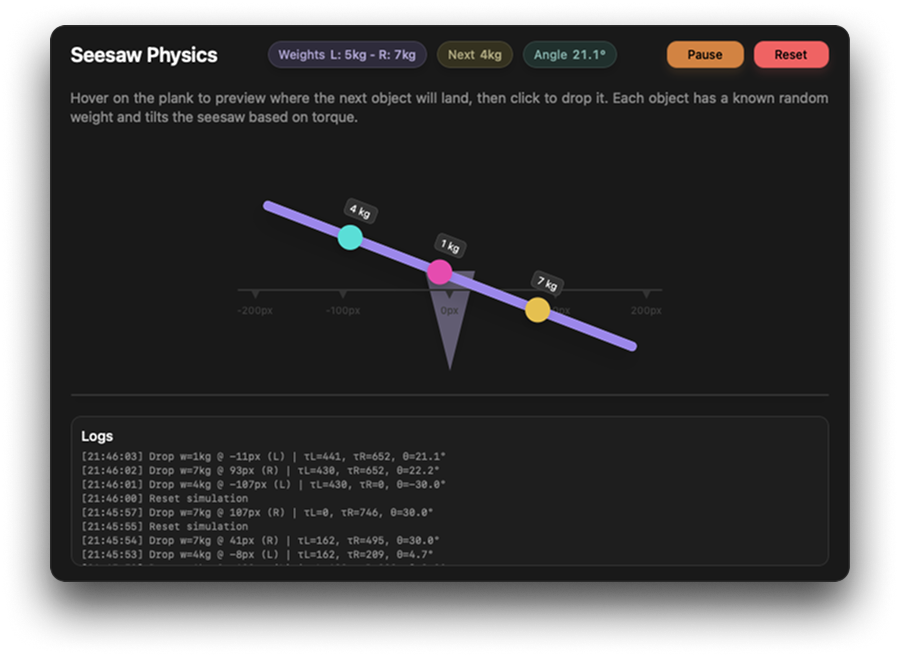
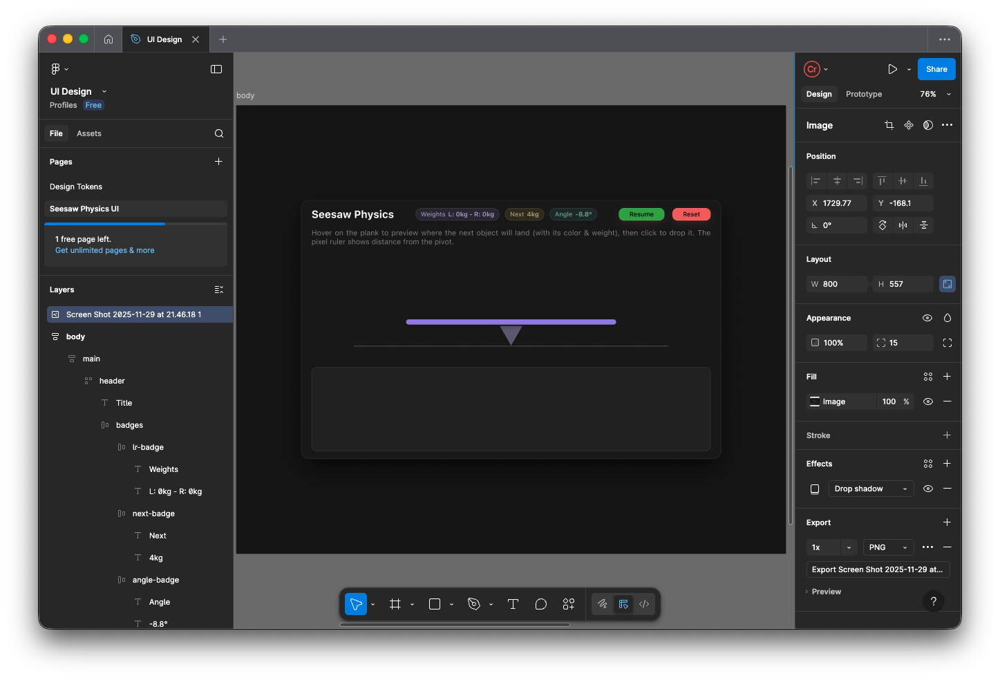

# Seesaw Physics

Seesaw Physics is a tiny web playground that visualizes basic torque
relationships on a seesaw. Drop weighted blocks anywhere along the plank,
watch the balances change in real time, and inspect the calculated moments
until the system finds a new equilibrium.

## Features

- Fully client-side experience built with plain HTML, CSS, and JavaScript
- Hover preview that shows where the next object will land before you click
- Randomized weights (1–10 kg) and colors so every drop is unique
- Live readouts for left/right weight totals, upcoming object, and seesaw angle
- Physics calculations based on torque differences, capped at ±30°
- Smooth easing animation, ambient UI sound, and running log of each action
- LocalStorage persistence so reloading the page restores the last setup

## Controls

- **Hover** over the plank to preview the next object's landing spot.
- **Click** to drop the current object at the highlighted position.
- **Reset** to clear every object, generate a new next weight, and zero the
  seesaw.

## Project Layout

- `index.html` – Shell page that wires up the UI components
- `public/styles.css` – Layout, theme variables, and component-level styles
- `public/script.js` – Simulation logic, rendering, persistence, and audio

## How the Simulation Works

- Every dropped object stores its distance from the pivot (in pixels) and
  weight (in kg).
- On each update, left and right torques are calculated by summing
  `weight * distance` for the respective side.
- The target angle is derived from the torque difference (`(τR - τL) / 10`) and
  clamped so the plank never exceeds ±30°.
- A lightweight easing loop interpolates between the current and target angle
  so the movement feels physical instead of jumpy.
- State is persisted in `localStorage` (`seesaw-physics-state-v1`) so refreshing
  the page reloads your stacked objects along with the upcoming weight/color.

## Development

Under subtitles "Thought Process & Design Decisions", "Tradeoffs & Limitations" and "AI Assist" I discussed various aspects of the development process in detail.

### Thought Process & Design Decisions

1. **Exploring the Concept**: I began by implementing the physics of seesaws, focusing on torque and balance principles. This helped me understand how to simulate the behavior accurately.
2. **Analyzing Existing Solutions**: I looked at existing projects that are similar to my project to identify best practices and potential pitfalls.
3. **Planning the Architecture**: Vanilla web technologies (HTML, CSS, JavaScript) were decided upon since the project is relatively simple and doesn't require complex frameworks.
4. **Realization of Hard Parts**: Interaction on a rotating plank was challenging. There were vector math calculations involved to ensure that the objects preview/drop correctly and the seesaw responds realistically.
5. **UI/UX Considerations**: I focused on creating an intuitive interface with clear visual feedback, such as animations, hover previews, real-time readouts and sound queues.
6. **Persistence**: I implemented `localStorage` to save the state of the seesaw and objects, allowing users to refresh the page without losing their setup.
7. **Extra Features**: I implemented a log system, scale marks, reset and pause functionality to improve user experience.

Based on these considerations, I started by desigining the UI in Figma. There were several iterations before finalizing the design.

With the design in place, I moved on to coding the UI components (static HTML/CSS) before implementing the core simulation logic in JavaScript. Figma's Auto Layout feature was particularly helpful in creating responsive designs that adapt to different screen sizes.

After the static components were ready, I started to think about responsivity of the seesaw itself. Because physics run on hard coded pixel values, I had to ensure that the seesaw and its components scale correctly on different screen sizes. I achieved this by using `transform: scale()` with a calculated scale factor based on the available width. To do this I had to create a wrapper around so that height can be controlled independently.

Achieving responsiveness gave me freedom to focus on vector operations that needed to be done for mouse interactions. I created a utility function `getMousePlankProjection(mouseX, mouseY)` that converts mouse coordinates to seesaw local coordinates and returns the parallel and perpendicular distances from the pivot. This function was crucial for both the hover preview and drop mechanics.

The physics calculations were straightforward, they didn't require much attention after the initial implementation. The torque calculations were based on the distance from the pivot and the weight of each object. I implemented a simple easing function to smoothly animate the seesaw's movement towards its target angle.

Sound effects were added to enhance the user experience. I used browsers' Web Audio API to play subtle sounds when objects are dropped. This added a layer of immersion to the simulation.

Persistance was implemented using `localStorage`. I created functions to save and load the state of the seesaw and its objects, ensuring that users could refresh the page without losing their setup.

### Tradeoffs & Limitations

1. **Layout Complexity**: Having a transform-based layout for the seesaw introduced challenges in positioning and scaling elements. While it allowed for a responsive design, it also made calculations for mouse interactions more complex. For a long time I struggled with getting the hover preview and drop mechanics to work correctly on a rotated plank.
2. **Absence of Frameworks**: While using vanilla JavaScript kept the project lightweight, it also provided modularity and reusability challenges. For larger projects, a framework might be more suitable.
3. **Math Precision**: The physics calculations are simplified and may not account for all real-world factors. This is acceptable for a basic simulation but could be improved for more accurate modeling.

The toughest challenge was getting the hover preview and drop mechanics to work correctly on a rotated plank. This required careful vector math calculations (and help from AI tools) to ensure that the objects landed where expected and that the seesaw responded realistically.

### AI Assist

I utilized AI tools to help brainstorm ideas, refine the math calculations, and troubleshoot issues with the hover preview and drop mechanics. AI assistance was particularly valuable in generating code snippets for vector math operations and easing functions, which sped up the development process significantly.

I started by looking into sample projects and discussing with AI about the approach. This helped me understand the core principles and how to implement them in code. After getting a grasp of the concept, I discussed how to make fully responsive layout with AI (the sample was not fully responsive), which led me to the idea of using `transform: scale()`. At this stage I also asked for help regarding the vector math calculations needed for mouse interactions, which was a challenging part of the project.

Finally I got assistance for implementing sound effects without relying on sound files, which was a neat solution to keep the project lightweight.

## License

Released under the MIT License. See `LICENSE.md` for details.
